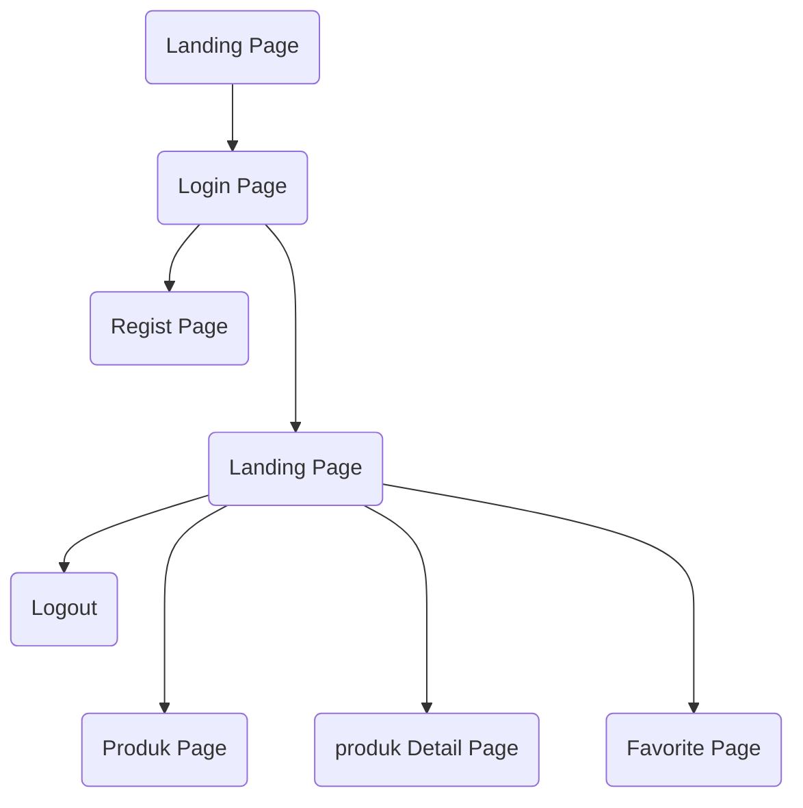
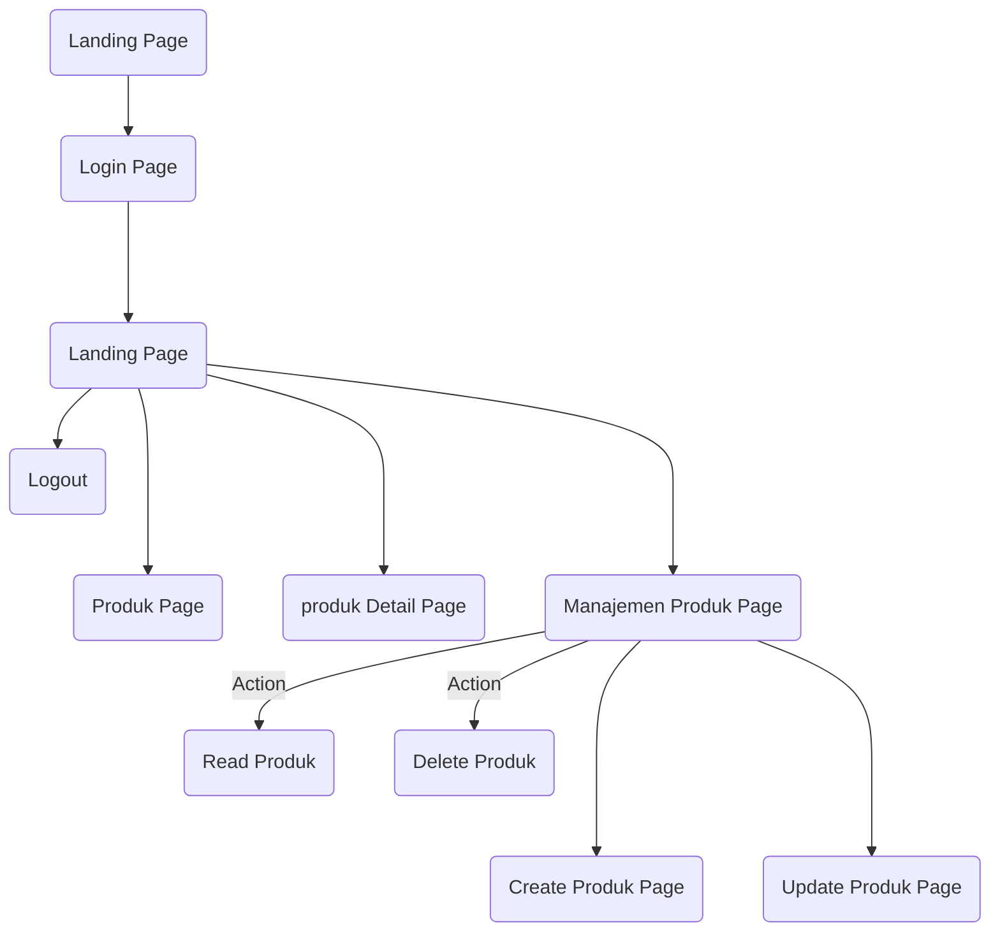

<!-- inspiring README PROJECTS -->

<!-- https://github.com/ma-shamshiri/Spam-Detector/blob/master/README.md -->
<!-- https://github.com/aregtech/areg-sdk/blob/master/README.md -->
<!-- https://github.com/gitpoint/git-point#readme -->

<!-- Logo Aplikasi -->

# Aurora Gems
### Kelompok 2 Website Katalog Perhiasan

Projek Akhir - Praktikum Framework

| NIM | NAMA | ROLE |
|------------|:----------------------:|:---------:|
| 2109106037 | Agustina Dwi Maharani | `Anggota` |
| 2109106040 | Natalie Fuad | `Ketua` |
 

## Table Of Content
 - [Introduction](#introduction)
 - [Alur Program](#alur-program)
 - [Job Desk](#job-desk)
 - [Features](#features)

## Introduction
<!-- tentang aplikasi -->

## Job Desk
 

| NIM | NAMA | JOB DESK |
|-----|:--------------------:|:--------: |
| 2109106037 | Agustina Dwi Maharani |`FE&BE Login Page` `FE&BE Landing Page` `FE&BE Product Page` `FE&BE Favorite Page` `FE&BE Manajemen Product Page`|
| 2109106050 | Natalie Fuad |`FE&BE Register Page` `FE&BE Landing Page` `FE&BE Product Detail Page` `FE&BE Manajemen Product Page`|

 

## Alur Program
<strong>Alur User</strong>

 
<strong>Alur Admin  </strong>

 

## Manual Book
Silahkan buka manual book Aurora Gems [disini](MANUALBOOK.md)

## Features
Fitur-fitur yang tersedia pada website Aurora Gems :
+ <strong>User</strong>
  

<code>Selengkapnya</code>

    
  + Regist
  + Login
  + Melihat detail produk
  + Menambah poduk ke favorite
  

+ <strong>Admin</strong>
  

<code>Selengkapnya</code>

    
  + Login
  + Melihat detail produk
  + Menambah poduk ke favorite
  + Manajemen data produk
      + Tambah data produk
      + Ubah data produk
      + Hapus data produk
  

 

  
[Back To Top](top)

